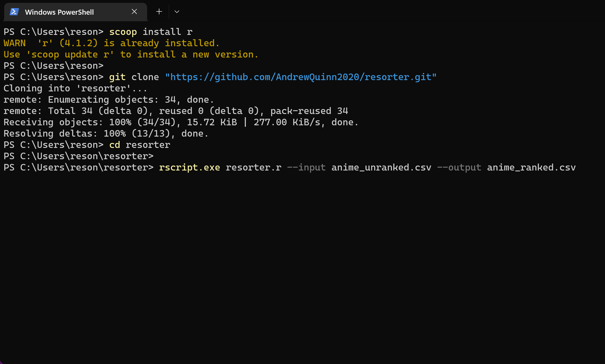

# `resorter`: CLI program for noisy pairwise rankings

This repo simplifies installing and running Gwern's [Resorter](https://www.gwern.net/Resorter).


# Quickstart

_On Windows, using [Scoop](https://scoop.sh)_

```powershell
scoop install r

git clone "https://github.com/AndrewQuinn2020/resorter.git"
cd resorter

rscript.exe resorter.r --input anime_unranked.csv --output anime_ranked.csv
```

_On Ubuntu, using [apt](https://ubuntu.com/server/docs/package-management)_

```bash
sudo apt install r-base

git clone "https://github.com/AndrewQuinn2020/resorter.git"
cd resorter

sudo Rscript resorter.r --input anime_unranked.csv --output anime_ranked.csv
# ┌──────────────────────────┐
# │ yes, capital R required~ │
# └──────────────────────────┘
#
# sudo required too, so that `Rscript` can install the BradleyTerry2 package.
# doing this in a venv is above my pay grade, sorry
```


# Demo




# Explanation

A much more thorough explanation is on Gwern's [Resorter](https://www.gwern.net/Resorter) page.

**How do you decide what to do?** More generally, how do you decide what is best out of a selection of options? It's actually pretty hard to look at a todo list or a bunch of 7s, 8s and 9s on a review site and sort them all from "Best use of my time" to "worst" in one go. And if we could, we probably wouldn't need those tools in the first place.

Much better would be a quick tool that just asks us to make a snap decision: **Is X better, or is Y better, or are they about the same?** Such a tool would have to account for the fact that we humans are not terribly good at consistency, either - we might rank X > Y one moment, and then X = Y or even Y > X the next.

Gwern's resorter handles all of that for us.


# Licensing

Gwern's entire website is in the [public domain](https://www.gwern.net/About#license).

I've opted to keep my copy of this code the same way, instead of switching to a [poison dart license](https://www.gwern.net/Evolutionary-Licenses#the-analogy) (even though [almost nobody actually sues on GPL-based grounds](https://www.greaterwrong.com/posts/gziZACDg6EBpGZbJe/almost-everyone-should-be-less-afraid-of-lawsuits#Most_lawsuit_types_are_rare) anyway).
